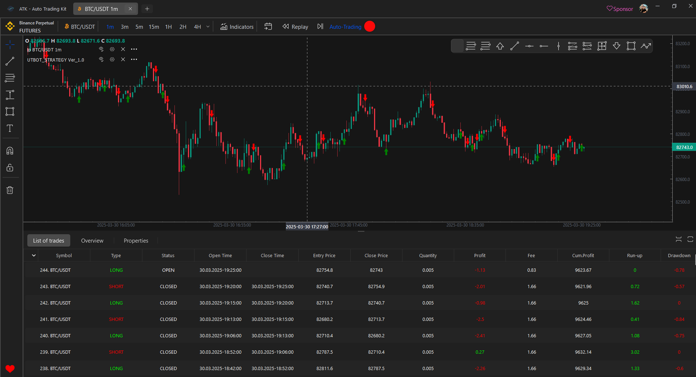
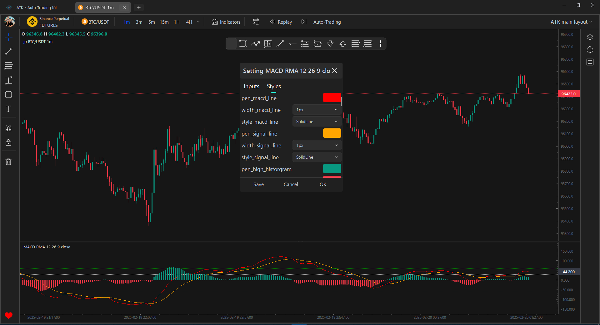

# ATK - Auto Trading Kit

This is a free software designed for traders and developers.

## Description

Auto Trading Kit: its mean, this project can be used to build your own strategy, backtest to test and improve strategy. and can live trading by using your strategy.

A project for trader from trader. main features: draw tool, popular indicator like Tradingview; connect with many popular exchanges like binance, mexc... via api and secret key to live trade; build custom indicator, and clone famous custom indicator on MT4, MT5 and Tradingview; Build and test strategies.
You can run ATK on Window/MacOS/Linux.

* 🔹**Automate Your Trades** with cutting-edge algorithms.
* 🔹**Real-time Market Analysis** with advanced indicators.
* 🔹**Optimized for Performance** using Python & PySide6.

This project is built for traders who want to  **enhance their strategy, reduce manual work, and execute trades efficiently** . Whether you’re a developer, trader, or enthusiast, your contributions can help improve this  **open-source trading platform** !

* ⭐**Star this repo** to support the project!
* 🔄 **Fork it** to customize & contribute!.
* 💬 **Join the discussion** and share your insights!

Let’s build the future of algorithmic trading together! 🚀🔥

## ATK - Features

|               **Features**               |                   **All Plan**                   |
| :--------------------------------------: | :----------------------------------------------: |
|           **Number of Charts**           |   Unlimited (depends on user's PC performance)   |
|         **Number of Indicators**         |                    Unlimited                    |
|                **Alerts**                |                Under Development                |
|           **Historical Data**           |                    Unlimited                    |
|             **Data Export**             |                Under Development                |
|           **Customer Support**           |                       8/5                       |
|            **Real-time Data**            |                       Yes                       |
|              **Auto Trade**              | Under Development (using API key and Secret key) |
|             **Backtesting**             |                       Yes                       |
|   **Basic and Advanced Drawing Tools**   |                       Yes                       |
|         **Support multiple tab**         |                       Yes                       |
|          **Support timeframe**          |                  Yes (1m to 1M)                  |
| **buy/sell market, limit, trallingstop** |                Under Development                |
|                **Crypto**                |                       Yes                       |
|                **Forex**                |                Under Development                |
|                **Stock**                |                Under Development                |

## Connect with ATK team

- Create an issue or request a new feature on this [Github repository](https://github.com/Khanhlinhdang/AutoTradingKit)
- If you want to update some personal feature, please sent an email to khanhlinhdangthditrach@gmail.com

## Many indicators, sourced from famous libraries such as [pandas-ta](https://github.com/twopirllc/pandas-ta/tree/main), and even indicators converted from TradingView,MT4,MT5

Currently provides below set of indicators. If your favourite indicator
is missing, then create a ticket via GitHub Issues and there is a good
chance that it will be included in the future version of ATK.

### Current indicators are supported

* Aroon
* Average Directional Index (ADX)
* Average True Range (ATR)
* Bollinger Bands (BB)
* Commodity Channel Index (CCI)
* Donchian Channel (DC)
* Keltner Channel (KC)
* Moving Average (ALMA, DEMA, EMA, HMA, KAMA, SMA, SMMA, T3, TEMA, VWMA, WMA, ZLEMA)
* Moving Average Convergence Divergence (MACD)
* Rate of Change (ROC)
* Relative strength index (RSI)
* Schaff Trend Cycle (STC)
* Stochastic Oscillator
* Stochastic RSI
* SuperTrend
* TRIX
* True Strength Index (TSI)
* Ultimate Oscillator (UO)
* Vortex Indicator (VTX)
* Volume Weighted Average Price (VWAP)
* Smart Money Concept (SMC)
* UTBOT
* ......

### Next indicators will be added

- TTM Squeeze
- Standard Deviation
- SFX TOR
- Pivots High/Low
- Parabolic SAR
- On-balance Volume (OBV)
- Smoothed On-balance Volume (SOBV)
- Mean Deviation
- McGinley Dynamic
- Mass Index
- Know Sure Thing (KST)
- Klinger Volume Oscillator (KVO)
- Ichimoku Kinko Hyo
- Force Index
- Detrended Price Oscillator (DPO)

* IBS
* Ease of Movement (EMV)
* Chaikin Oscillator
* Chande Kroll Stop
* Choppiness Index (CHOP)
* Coppock Curve
* Awesome Oscillator (AO)
* Balance of Power (BOP)
* Accumulation/Distribution (ADL)
* .....

### Easy to add a new indicator to ATK, follow the steps below, or simply input  the prompt provided below into ChatGPT/GitHub Copilot,

As the code  structure and principles for each indicator in ATK are the same.to add new indicator to ATK, Do these step above, because structure of the code of any indicator is the same

For excample to implement indicator "bop" to ATK.

To create a new sub-indicator for ATK using the pandas_ta library, the following requirements must be met:

1. In the "atklip\controls" folder, within each subfolder corresponding to the folders in "atklip\controls\pandas_ta", create a .py file with the same name as the file in the pandas_ta library.
   For example: The file "atklip\controls\momentum\cci.py" is the code file for the CCI indicator, corresponding to "atklip\controls\pandas_ta\momentum\cci.py". However, ensure to import the corresponding indicator calculation function from the pandas_ta library located in the "atklip\controls\pandas_ta" folder.
2. Thoroughly study the `calculate` function to determine the column names and ensure accurate calculations corresponding to the names of each column in the returned result after calculating the indicator.
3. In the folder "atklip\graphics\chart_component\indicators\sub_indicators", also create a file with the same name as the indicator being generated. The code structure should be similar to the existing files. Ensure the code closely follows the structure of the template file, but modify it to suit the new indicator. Pay special attention to the `self.has` attribute and ensure it is correctly converted based on the new indicator's information.
4. Add a new Model class for the new indicator in the file "atklip\controls\models.py".
5. In the file "atklip\gui\top_bar\indicator\indicator_menu.py", add the corresponding new indicator's `IndicatorType` information to the `dict_indicators` variable.
6. If the `IndicatorType` information for the indicator is not yet available in the file "atklip\controls\ma_type.py", add the `IndicatorType` information for the new indicator to the `IndicatorType` class in "atklip\controls\ma_type.py".
7. Update the new indicator in the "sub_panel_indicator" by adding the new indicator's information to the `setup_indicator` function in the file "atklip\graphics\chart_component\sub_panel_indicator.py".

Apply the above requirements to create the files "atklip\controls\momentum\bop.py", corresponding to "atklip\controls\pandas_ta\momentum\bop.py", and create the file "atklip\graphics\chart_component\indicators\sub_indicators\bop.py".

## Installation

Prerequirement: python 3.12 , Window 10/11 64bit/MacOS/Linux

clone from:  https://github.com/Khanhlinhdang/AutoTradingKit

create python evironment: python -m venv .venv

activate venv: .venv/scripts/activate

install libs: pip install -r requirements.txt for Window

OR install libs: pip install -r mac_linux_requirements.txt for MacOS/LinuxWindow

run ATK.py to start app: python ATK.py or python3 ATK.py

## Build application

- Convert py to pyd/so using cython to improve perfomance
- Use pyinstaller to build exe on window, so on linux/macos

## Roadmap 2025

1) Update more indicator from MT4, MT5, Tradingview
2) Update Trading Strategies
3) Update set API-Key and Secret-Key for pupular exchanges like Binance, Mexc,...
4) Update Draw tool on left bar like Tradingview
5) Update Replay/Backtest function
6) Update save fovarite layouts
7) Update setting: change Light/Dark mode
8) Update change style of draw tool like color, width, size, font
9) Update Table Order and position of backtest and live trade
10) Update login and manage account
11) Build AI indicator
12) Build AI Strategy

## MIT License

Copyright (c) 2025 Pham Cong Che

Permission is hereby granted, free of charge, to any person obtaining a copy
of this software and associated documentation files (the "Software"), to deal
in the Software without restriction, including without limitation the rights
to use, copy, modify, merge, publish, distribute, sublicense, and/or sell
copies of the Software, and to permit persons to whom the Software is
furnished to do so, subject to the following conditions:

The above copyright notice and this permission notice shall be included in all
copies or substantial portions of the Software.

THE SOFTWARE IS PROVIDED "AS IS", WITHOUT WARRANTY OF ANY KIND, EXPRESS OR
IMPLIED, INCLUDING BUT NOT LIMITED TO THE WARRANTIES OF MERCHANTABILITY,
FITNESS FOR A PARTICULAR PURPOSE AND NONINFRINGEMENT. IN NO EVENT SHALL THE
AUTHORS OR COPYRIGHT HOLDERS BE LIABLE FOR ANY CLAIM, DAMAGES OR OTHER
LIABILITY, WHETHER IN AN ACTION OF CONTRACT, TORT OR OTHERWISE, ARISING FROM,
OUT OF OR IN CONNECTION WITH THE SOFTWARE OR THE USE OR OTHER DEALINGS IN THE
SOFTWARE.

## Project status

The ATK is in an active development phase.

### **Support ATK Development and Help Us Grow!**

Dear ATK Users and Supporters,

ATK has been a valuable tool for many of you, helping to streamline workflows, solve problems, and improve productivity. However, maintaining and improving ATK requires significant resources, especially as we work to develop new features, fix bugs, and ensure the project remains sustainable for the long term.

To continue delivering the best experience for our users, we need your support. Your sponsorship will directly fund:

* **Development of new features** outlined in our Roadmap, ensuring ATK evolves to meet your needs.
* **Bug fixes and optimizations** to keep ATK stable, reliable, and efficient.
* **Support for our developers** , who work tirelessly to make ATK better every day.

**Why Sponsor ATK?**

* If ATK has helped you in your work or personal projects, your contribution ensures it can continue to do so for others.
* Your support allows us to prioritize features and improvements that matter most to the community.
* Sponsoring ATK is an investment in a tool you already rely on, ensuring its growth and sustainability.

**How You Can Help:**

* Click the link below to sponsor ATK via PayPal. Every contribution, no matter the size, makes a difference.
* You can sent to me a gift via my bank account (Vietnamese Bank), it is shown below
* Share this message with others who benefit from ATK. The more support we receive, the faster we can deliver new features and improvements.

**Thank You for Your Support!**
Your generosity and belief in ATK mean the world to us. Together, we can make ATK even better and ensure it remains a powerful tool for everyone who depends on it.

With gratitude,
mr.BigD - Creator/Developer of ATK

1. Bank account: MB Bank: 8699991689999 | Pham Cong Che | (Viet Nam Bank)
2. [Github Sponsor](https://github.com/sponsors/Khanhlinhdang)
3. [opencollective](https://opencollective.com/autotradingkit)
4. Paypal:

- [Paypal sponsor](https://www.paypal.com/cgi-bin/webscr?cmd=_s-xclick&hosted_button_id=XTHUBP3TB5H7J) (khanhlinhdangthditrach@gmail.com) (any value)
- [Sponsor via paypal](https://www.paypal.com/ncp/payment/363TPLRF4NAF4)  20$
- [Sponsor via Paypal ](https://www.paypal.com/ncp/payment/G9R3YNN89KR8Y)10$
- [Premium Sponsor monthly via Subscribe paypal](https://www.paypal.com/webapps/billing/plans/subscribe?plan_id=P-0F53588022198101GM63BMVA)
- [Vip 1 Sponsor monthly via Subscribe paypal](https://www.paypal.com/webapps/billing/plans/subscribe?plan_id=P-06E5757414542143MM63BSGI)
- [Vip 2 Sponsor monthly via Subscribe paypal](https://www.paypal.com/webapps/billing/plans/subscribe?plan_id=P-00V92834XG336831FM63BTEQ)

3. Binance pay:

## Authors and acknowledgment

Pham Cong Che (nickname: BigD) - A trader, a freelancer and a developer from Viet Nam. The author of ATK.

Email: khanhlinhdangthditrach@gmail.com

Skype: khanhlinhdangthditrach@gmail.com

Zalo: 0343845888

Telegram: +79921849116 or username : @Chelinh0308

Phone number: +84343845888 (VietNamese phone number)

Youtube Chanel: [AutoTradingKit](https://www.youtube.com/@AutoTradingKit)

Author's Facebook: [Pham Cong Che](https://www.facebook.com/che.linh.9096/)

Discord: [AutoTradingKit](https://discord.com/channels/1342693850350751774/)

ATK Facebook Group: [Auto Trading Kit (ATK) - Facebook group](https://www.facebook.com/groups/748831980507126 "Facebook group of ATK")
