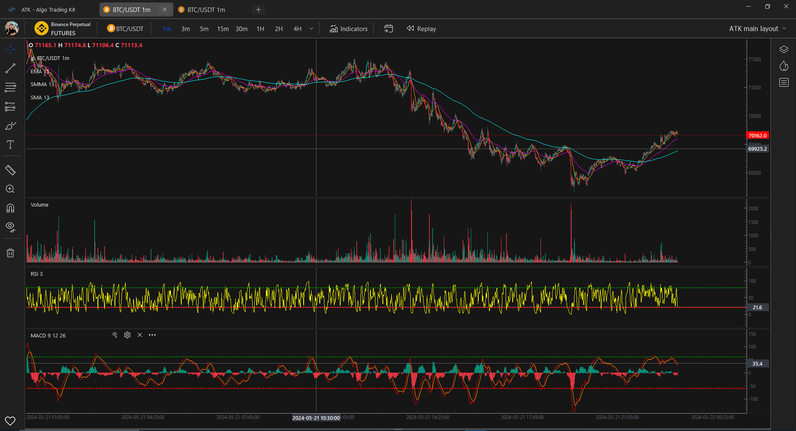

# ATK - Auto Trading Kit

## Getting started



## Add your files

- [ ] [Create](https://docs.gitlab.com/ee/user/project/repository/web_editor.html#create-a-file) or [upload](https://docs.gitlab.com/ee/user/project/repository/web_editor.html#upload-a-file) files
- [ ] [Add files using the command line](https://docs.gitlab.com/ee/gitlab-basics/add-file.html#add-a-file-using-the-command-line) or push an existing Git repository with the following command:

```
cd existing_repo
git remote add origin https://github.com/Khanhlinhdang/AutoTradingKit.git
git branch -M main
git push -uf origin main
```

## Integrate with your tools

- [ ] [Set up project integrations](https://gitlab.com/khanhlinhdangthditrach/att-algo-trading-tools/-/settings/integrations)

## Collaborate with your team

- [ ] [Invite team members and collaborators](https://docs.gitlab.com/ee/user/project/members/)
- [ ] [Create a new merge request](https://docs.gitlab.com/ee/user/project/merge_requests/creating_merge_requests.html)
- [ ] [Automatically close issues from merge requests](https://docs.gitlab.com/ee/user/project/issues/managing_issues.html#closing-issues-automatically)
- [ ] [Enable merge request approvals](https://docs.gitlab.com/ee/user/project/merge_requests/approvals/)
- [ ] [Set auto-merge](https://docs.gitlab.com/ee/user/project/merge_requests/merge_when_pipeline_succeeds.html)

## Test and Deploy

Use the built-in continuous integration in GitLab.

- [ ] [Get started with GitLab CI/CD](https://docs.gitlab.com/ee/ci/quick_start/index.html)
- [ ] [Analyze your code for known vulnerabilities with Static Application Security Testing (SAST)](https://docs.gitlab.com/ee/user/application_security/sast/)
- [ ] [Deploy to Kubernetes, Amazon EC2, or Amazon ECS using Auto Deploy](https://docs.gitlab.com/ee/topics/autodevops/requirements.html)
- [ ] [Use pull-based deployments for improved Kubernetes management](https://docs.gitlab.com/ee/user/clusters/agent/)
- [ ] [Set up protected environments](https://docs.gitlab.com/ee/ci/environments/protected_environments.html)

---

# Editing this README

When you're ready to make this README your own, just edit this file and use the handy template below (or feel free to structure it however you want - this is just a starting point!). Thanks to [makeareadme.com](https://www.makeareadme.com/) for this template.

## Suggestions for a good README

Every project is different, so consider which of these sections apply to yours. The sections used in the template are suggestions for most open source projects. Also keep in mind that while a README can be too long and detailed, too long is better than too short. If you think your README is too long, consider utilizing another form of documentation rather than cutting out information.

## Name

Auto Trading Kit: its mean, this project can be used to build your own strategy, backtest to test and improve strategy. and can live trading by using your strategy

## Description

A project for trader from trader. main features: draw tool, popular indicator like Tradingview; connect with popular exchange like binance, mexc via api and secret key to live trade; build custom indicator, and clone famous custom indicator on tradingview; build and test strategies.

## Badges

On some READMEs, you may see small images that convey metadata, such as whether or not all the tests are passing for the project. You can use Shields to add some to your README. Many services also have instructions for adding a badge.

## Indicators from talipp library

 Currently provides below set of indicators. If your favourite indicator
 is missing, then create a ticket via GitHub Issues and there is a good
chance that it will be included in the future version of the library.

(https://github.com/nardew/talipp)

* Accumulation/Distribution (ADL)
* Aroon
* Average Directional Index (ADX)
* Average True Range (ATR)
* Awesome Oscillator (AO)
* Balance of Power (BOP)
* Bollinger Bands (BB)
* Chaikin Oscillator
* Chande Kroll Stop
* Choppiness Index (CHOP)
* Coppock Curve
* Commodity Channel Index (CCI)
* Donchian Channel (DC)
* Detrended Price Oscillator (DPO)
* Ease of Movement (EMV)
* Force Index
* IBS
* Ichimoku Kinko Hyo
* Keltner Channel (KC)
* Klinger Volume Oscillator (KVO)
* Know Sure Thing (KST)
* Mass Index
* McGinley Dynamic
* Mean Deviation
* Moving Average (ALMA, DEMA, EMA, HMA, KAMA, SMA, SMMA, T3, TEMA, VWMA, WMA, ZLEMA)
* Moving Average Convergence Divergence (MACD)
* On-balance Volume (OBV), Smoothed On-balance Volume (SOBV)
* Parabolic SAR
* Pivots High/Low
* Rate of Change (ROC)
* Relative strength index (RSI)
* Schaff Trend Cycle (STC)
* SFX TOR
* Standard Deviation
* Stochastic Oscillator
* Stochastic RSI
* SuperTrend
* TRIX
* TTM Squeeze
* True Strength Index (TSI)
* Ultimate Oscillator (UO)
* Vortex Indicator (VTX)
* Volume Weighted Average Price (VWAP)

## Installation

clone from: https://github.com/Khanhlinhdang/AutoTradingKit.git

create python evironment: python -m venv venv

activate venv: venv/scripts/activate

install libs: pip install -r requirements.txt

pip install -U git+https://github.com/twopirllc/pandas-ta.git@development (cai ban pandas-ta development)

run mainwindow.py to start app: python mainwindow.py

## Build exe

- replace this function in atklip.gui.qfluentwidgets.common.icon để thay đổi đường dẫn đến folders lưu ảnh
- ```
  def change_svg_color(value:str, new_color):
      path = f'_internal/atklip/gui/qfluentwidgets/_rc/images/icons/{value.lower()}_white.svg'
      new_path = f'_internal/atklip/gui/qfluentwidgets/_rc/images/icons/{value.lower()}_tradingview.svg'
      if os.path.exists(new_path):
          return new_path
      file = open(path,"r")
      text = file.read()
      file.close()
      file = open(new_path,'w')
      new_text = text.replace("rgb(255,255,255)",new_color).replace("rgb(0,0,0)",new_color).replace("white",new_color).replace("rgb(247,245,245)",new_color) 
      file.write(new_text)
      file.close()
      return new_path
  ```
- convert all py file sang py extention bằng cython
- xóa hết file .py gốc
- Sử dụng autopytoexe để build
- 

```

```

## USE LINK

https://github.com/bfolkens/py-market-profile

https://github.com/neurotrader888/VSAIndicator

https://github.com/neurotrader888/RSI-PCA

https://github.com/beinghorizontal/tpo_project

https://github.com/letianzj/quanttrader/tree/master

https://github.com/beinghorizontal/Support-Resistance

## Support

email: khanhlinhdangthditrach@gmail.com

skype: khanhlinhdangthditrach@gmail.com

facebook: [ATT (Auto Trading tools) | Facebook](https://www.facebook.com/groups/748831980507126)

## Roadmap

1) Update Sub-Indicator: Volume, RSI, MACD...
2) Update Trading Strategies
3) Update set API-Key and Secret-Key for pupular exchanges like Binance, Mexc,...
4) Update Draw tool on left bar like Tradingview
5) Update Replay/Backtest function
6) Update save fovarite layouts
7) Update setting: change Light/Dark mode
8) Update change style of draw tool like color, width, size, font
9) Update Table Order and position of backtest and live trade
10) Update login and manage account
11) Build AI indicator
12) Build AI Strategy

## Contributing

State if you are open to contributions and what your requirements are for accepting them.

For people who want to make changes to your project, it's helpful to have some documentation on how to get started. Perhaps there is a script that they should run or some environment variables that they need to set. Make these steps explicit. These instructions could also be useful to your future self.

You can also document commands to lint the code or run tests. These steps help to ensure high code quality and reduce the likelihood that the changes inadvertently break something. Having instructions for running tests is especially helpful if it requires external setup, such as starting a Selenium server for testing in a browser.

## Authors and acknowledgment

Pham Cong Che (nickname: BigD)- a trader, freelancer developer from Viet Nam

## License

For open source projects, say how it is licensed.

## Project status

On active update
